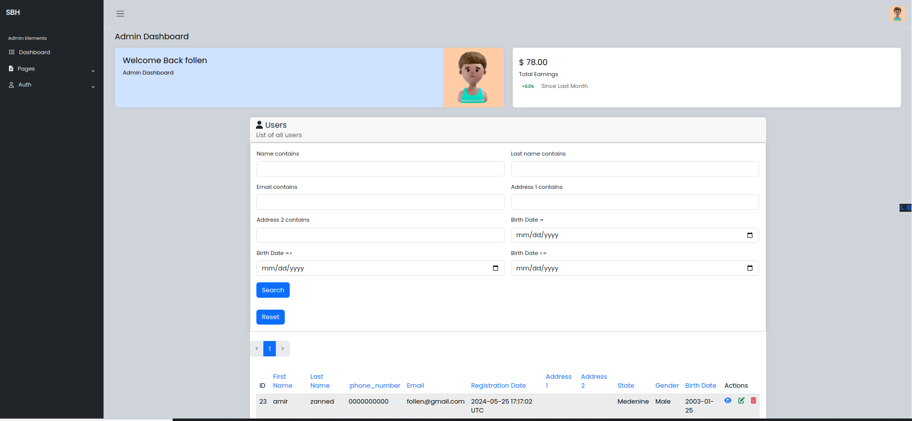
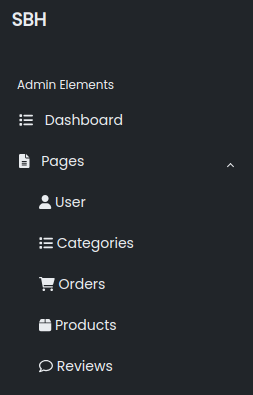
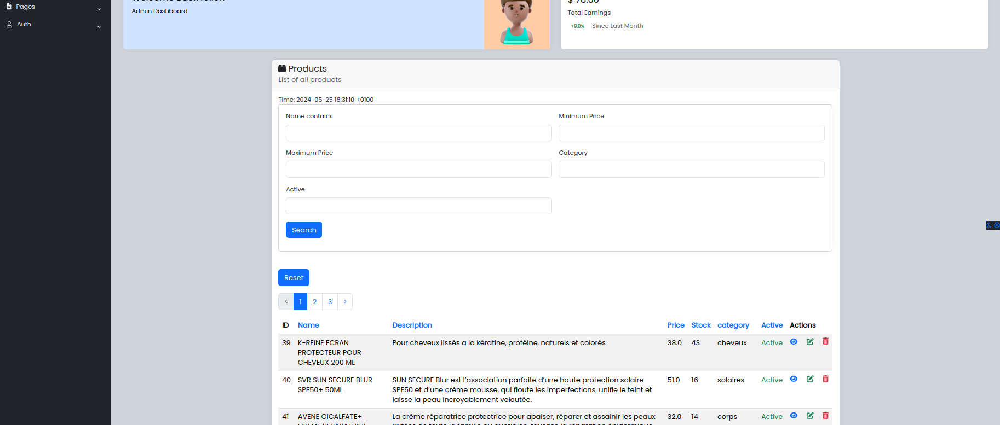
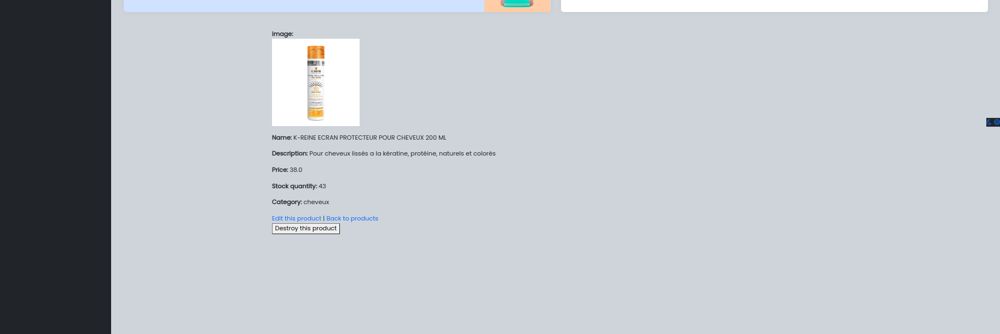
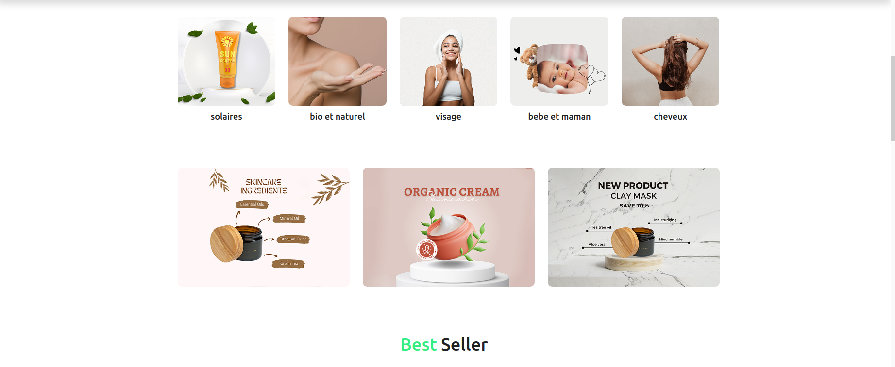
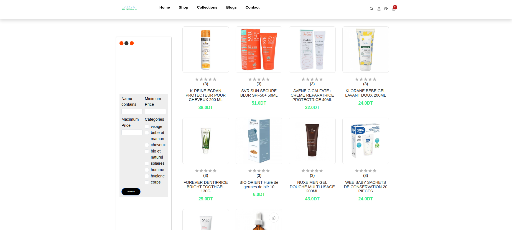
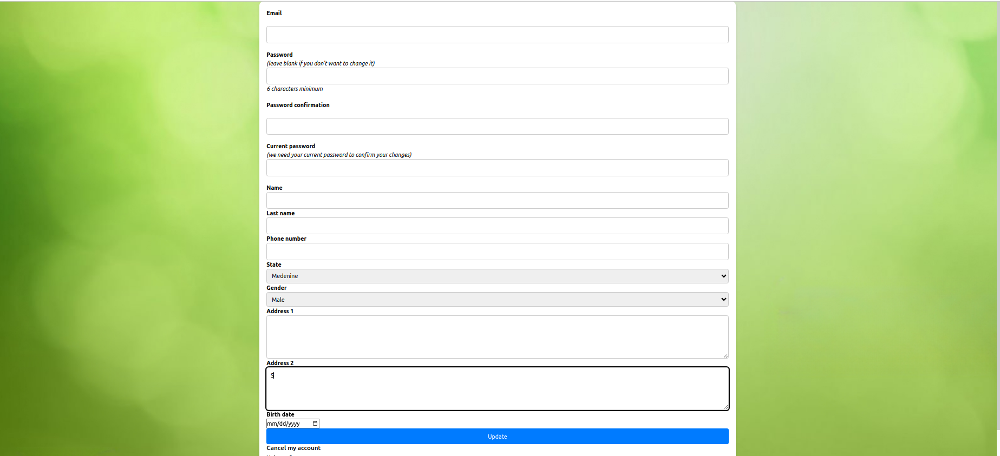
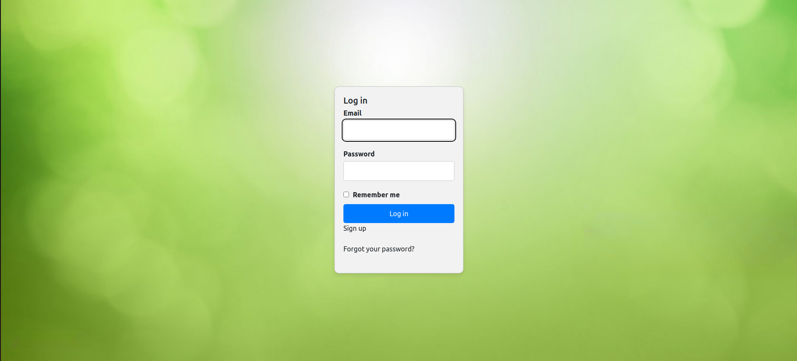
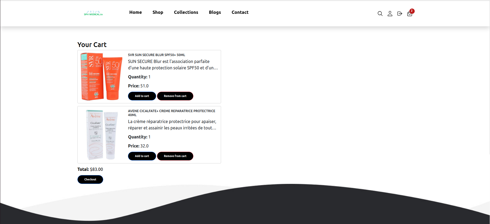

# Rails E-commerce Project

A Ruby on Rails e-commerce application with separate admin and client parts.

## Features

### Admin Part







- **Authentication:** Separate device model.
- **Session Management:** Sessions expire after inactivity.
- **Image Uploads:** Managed with Active Storage.
- **Pagination:** Handled with Pagy.
- **Search:** Implemented using Ransack.
- **CRUD Operations:** Manage reviews, users, products, orders, and order details.

### Client Part







- **Authentication:** Separate device model.
- **Shopping Cart:** Session-based cart management.
- **Image Viewing:** Product images managed with Active Storage.
- **Pagination:** Handled with Pagy.
- **Search:** Implemented using Ransack.

## Installation

1. **Clone the repository:**
    ```sh
    git clone https://github.com/Zanned-Amir/SBH_Rails.git
    cd SBH_Rails
    ```

2. **Install dependencies:**
    ```sh
    bundle install
    yarn install
    ```

3. **Set up the database:**
    ```sh
    rails db:create
    rails db:migrate
    rails db:seed
    ```

4. **Start the Rails server:**
    ```sh
    rails server
    ```

## Usage

### Admin Panel


- Access via `/admin`.
- Manage products, orders, and images.
- Search and pagination features.

### Client Interface


- Access via root URL.
- Browse products, manage cart, and checkout.
- Search and pagination features.

## Security


- Admin sessions expire after inactivity.
- Separate authentication for admin and client.
- Secure session management for the shopping cart.


